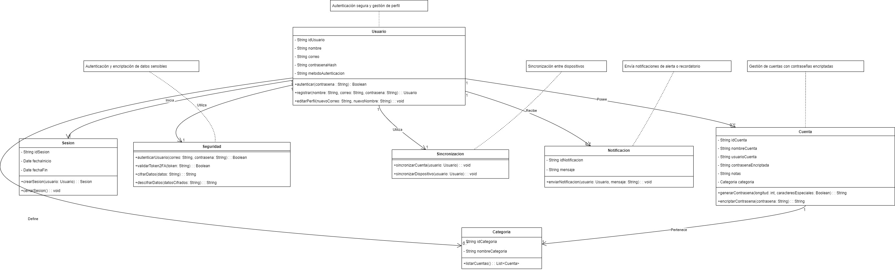

# **Gestor de Contraseñas con Laravel, React e Inertia.js**

## **Descripción General**
Este proyecto es una aplicación web diseñada para la gestión segura de contraseñas, autenticación de usuarios, y sincronización de datos entre dispositivos. Implementa características como encriptación de datos sensibles, autenticación robusta, notificaciones, y sincronización en tiempo real.

La aplicación está construida con **Laravel** como framework backend, utilizando **Inertia.js** para integrar componentes **React** en el frontend, lo que proporciona una experiencia de usuario moderna y dinámica.

---

## **Características Principales**
1. **Gestión de Contraseñas:**
   - Cifrado seguro de contraseñas utilizando `bcrypt`.
   - Generación automática de contraseñas con personalización (longitud, caracteres especiales).
   - Categorías para organizar cuentas.

2. **Autenticación de Usuarios:**
   - Registro, inicio de sesión y recuperación de contraseñas mediante **Laravel Breeze**.
   - Soporte para **Autenticación de Dos Factores (2FA)**.
   - Hashing seguro de contraseñas.

3. **Notificaciones:**
   - Envío de notificaciones a usuarios (emails, SMS o notificaciones push).
   - Recordatorios o alertas críticas relacionadas con las cuentas.

4. **Sincronización de Dispositivos:**
   - Sincronización de datos entre múltiples dispositivos en tiempo real utilizando **Laravel Echo** y **WebSockets**.

5. **Interfaz de Usuario Moderna:**
   - Frontend desarrollado con **React** y estilizado con **TailwindCSS**.
   - Experiencia fluida tipo SPA (Single Page Application) mediante **Inertia.js**.

---

## **Tecnologías Utilizadas**
### **Backend**
- **Laravel 11.x**: Framework principal para la lógica del negocio y gestión de datos.
- **PHP 8.2**: Lenguaje de programación backend.
- **PostgreSQL**: Base de datos relacional.
- **Redis** (opcional): Para caché y colas de procesamiento.

### **Frontend**
- **React**: Framework para construir componentes interactivos.
- **Inertia.js**: Integra React con Laravel para facilitar el desarrollo de SPA.
- **TailwindCSS**: Framework CSS para diseño moderno y responsivo.

### **Otros Servicios**
- **Firebase Cloud Messaging (FCM):** Para notificaciones push.
- **Mailgun:** Para notificaciones por correo electrónico.
- **Heroku:** Plataforma para el despliegue.

---

## **Estructura del Proyecto**
### **Directorios Principales**
- `/app`: Contiene la lógica del backend, como controladores y modelos.
- `/resources/js`: Contiene los componentes React para el frontend.
- `/resources/views`: Plantillas de Laravel utilizadas por Inertia.js.
- `/public`: Archivos estáticos del proyecto (CSS, JS, imágenes).
- `/database`: Migraciones y seeders para la base de datos.

---

## **Requisitos del Sistema**
### **Servidor**
- **PHP** >= 8.2
- **Composer** para la gestión de dependencias.
- **Node.js** >= 18.x para compilar recursos frontend.
- **PostgreSQL** como base de datos principal.

### **Entorno de Desarrollo**
- **Laravel Sail** (opcional): Para un entorno de desarrollo basado en Docker.

---

